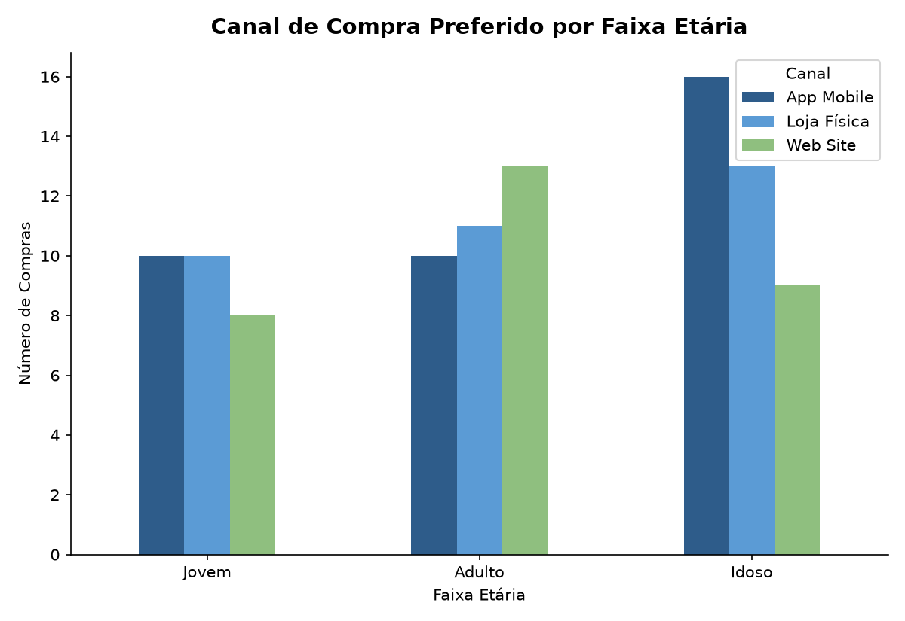
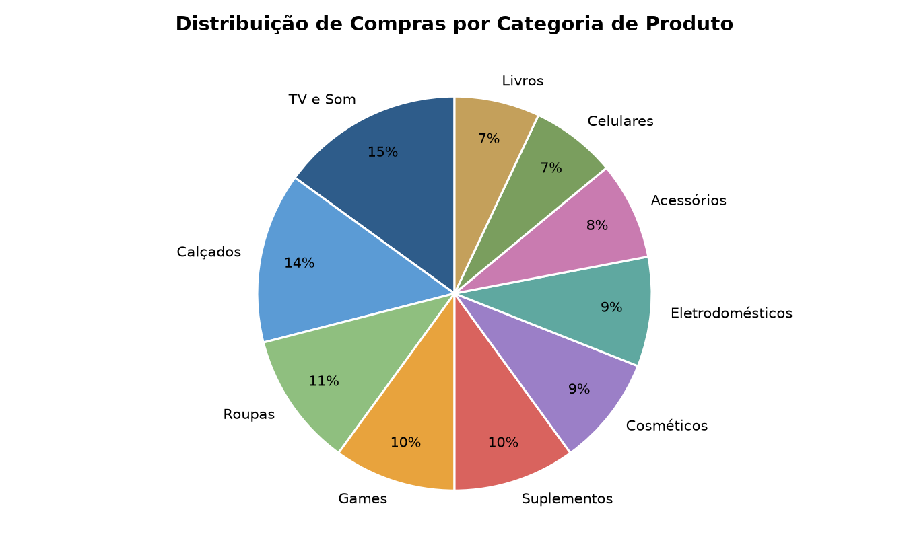
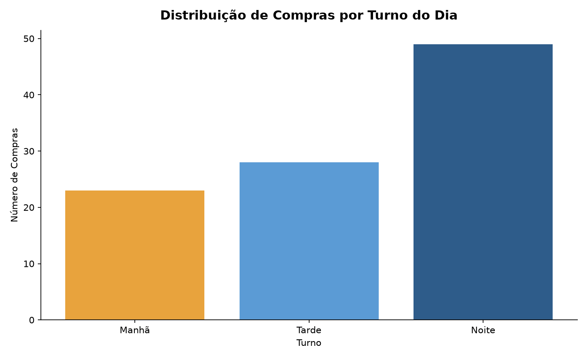
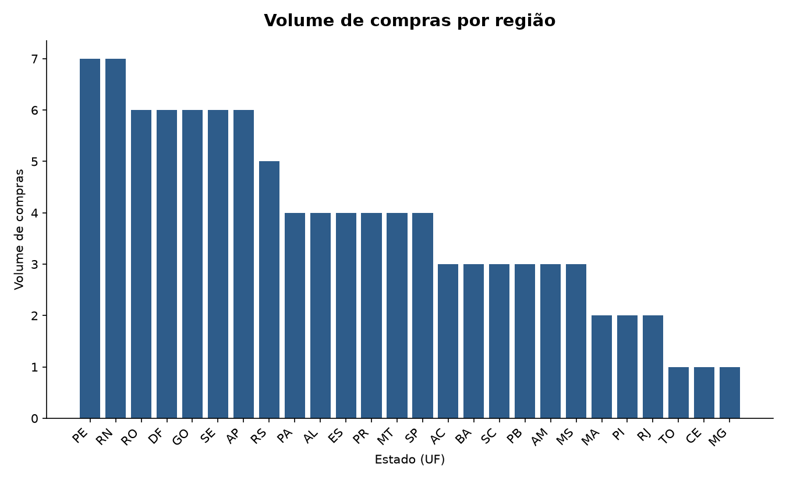

# Retail Max - Análise de Padrões de Compra

## 1. Introdução
Este relatorio tem como objetivo apresentar uma análise exploratoria e padrões de comportamento de uma base de dados de vendas de uma empresa fictícia chamada Retail Max.  
A análise utiliza uma base de dados de varejo com informações de idade, gênero, valor gasto, categoria dos produtos, horário, canal de compra, cidade e estado.  
O objetivo é identificar padrões de comportamento dos clientes, tendências de vendas e gerar insights que possam auxiliar na tomada de decisão estratégica da empresa.

## 2. Metodologia
A análise foi conduzida em etapas:
- **Preparação dos dados**: Limpeza e tratamento da base de dados e a criação de variáveis derivadas para facilitar a análise.
- **Estatística descritiva**: Contagens, medias e distribuições para as variáveis categóricas e numéricas.
- **Tabulação cruzada (crosstab)**: Cruzamento de variáveis para identificar padrões de comportamento e relações entre diferentes atributos.
- **Visualização de dados**: Construção de gráficos para tornar os padrões mais evidentes e facilitar a interpretação dos resultados.
- **Interpretação dos resultados**: Análise dos padrões identificados e geração de insights para a empresa.
- **Ferramentas utilizadas**: Python, Pandas, Matplotlib, Numpy e scikit-learn.

## 3. Análise de dados
Foram feitas análises exploratórias para entender o comportamento dos clientes e identificar padrões de compra.
### 3.1 Canal de compra por faixa etária  
Os clientes foram classificados em tres faixas etárias: jovens (18-30 anos), adultos (31-50 anos) e idosos (51 anos ou mais).  
Clientes idosos são o maior grupo da base, com 38% do total e concentram a maior adesão ao App Mobile (42% das compras), enquanto clientes adultos tem o Web Site como canal preferido (38% das compras).

### 3.2 Categorias de produtos mais compradas 
Tv e som e a categoria líder em volume de vendas representando 15% do total de compras, seguida por Calçados, com 14%, e Roupas, com 11%. Games e Suplementos também apresentam participação relevante, com 10% cada.

### 3.3 Compras por turno do dia  
Quase metade das compras (49%) ocorrem no periodo da noite. Dentro desse turno, a categoria mais comprada tambem e Tv e Som, seguido de Calcados.

### 3.4 Volume de compras por Estado
Não há uma concentração regional dominante: os estados líderes têm entre 5 e 7 compras cada, numa distribuição relativamente pulverizada entre 26 estados.

### 3.5 Dispersao de compras por idade e valor gasto

